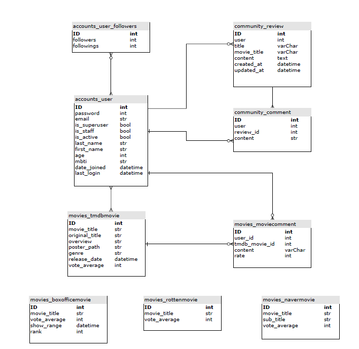
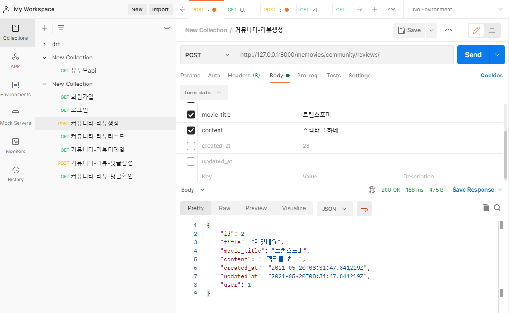
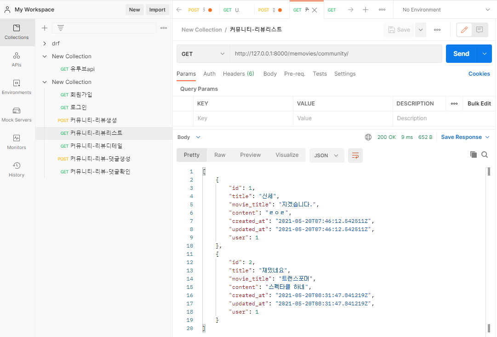
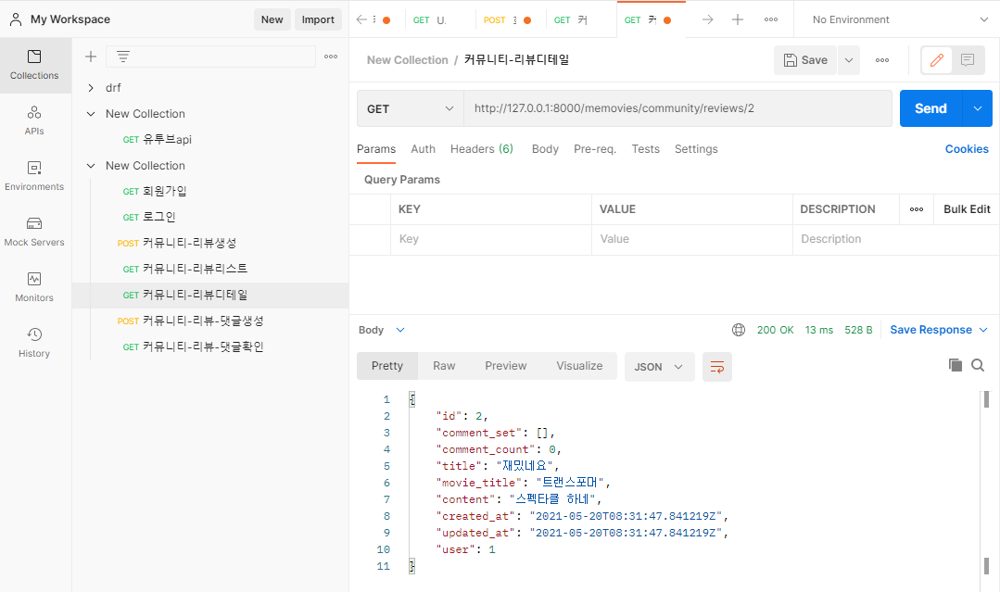
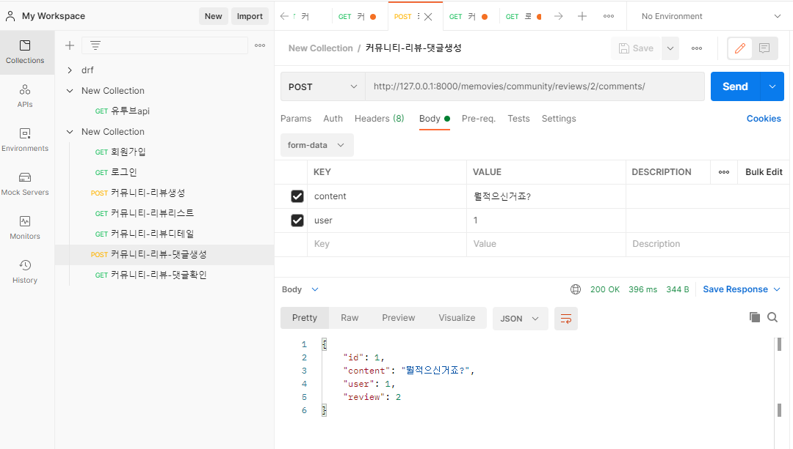
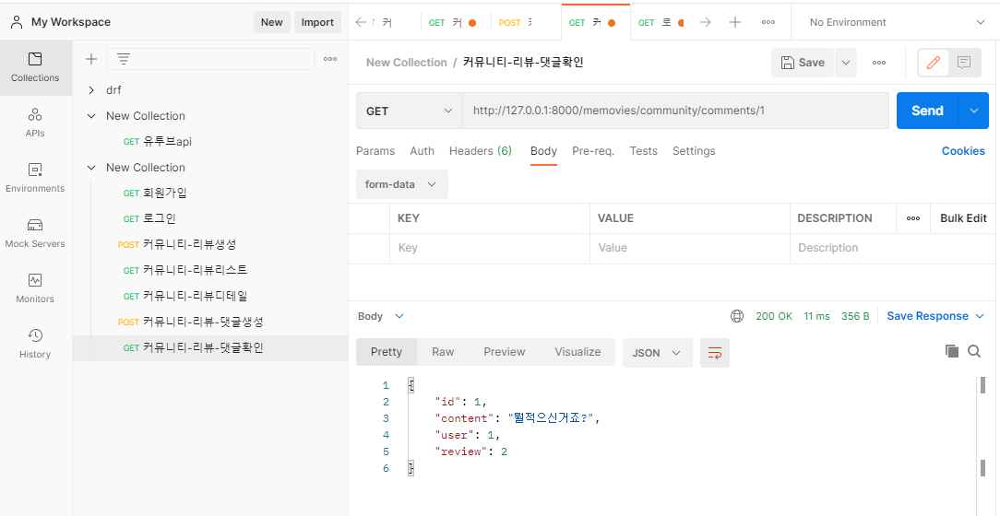

# 5/20

- 모델 ERD 설계

- 게시판의 구현 - 리뷰생성 + 리뷰의 댓글 생성

-----------

### ERD

- ERD 다이어그램 툴 : Draw.io  사용

### Community

- 리뷰 게시판은 기본적인 CRUD를 구현

- 커뮤니티-리뷰생성

- 커뮤니티-리뷰리스트

- 커뮤니티-리뷰디테일

- 커뮤니티-리뷰- 댓글생성

- 커뮤니티-리뷰- 댓글확인

------

## 느낀점

5/20

- 프로젝트의 컨셉과 추가기능을 애기하면서 웹사이트의 모습이 구체화되는걸 보면 재미있었다.  

- 본격적으로 깃헙을 통한 협업을 통해서 진행했는데 후에 팀프로젝트나, 현업에서 도움될만한 경험일것이다.

- ERD 생성을 하면서 확신이 안들때도 있어서 미숙한걸 느꼈지만 이는 실제로 구현을 진행하면서 고쳐나가도록 한다.