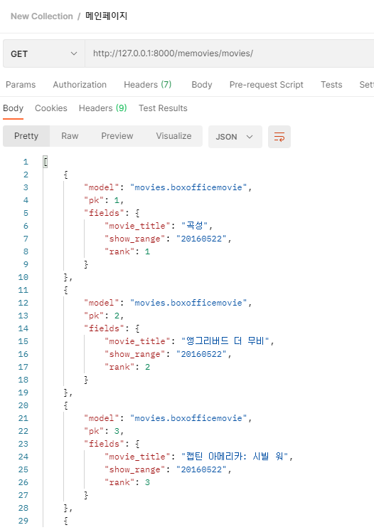
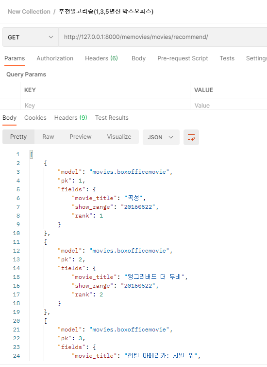

# 5/21

- 박스오피스 API DB에 넣어서 프론트에 넘겨주기
- 박스오피스 API를 통해서 추천페이지 구현
- 영화의 댓글기능 (구현 중)

------

### Box office API

박스오피스 API 를 불러와서 장고에서 데이터를 가공하고 프론트에 넘겨주는게 계획이었다.

api는 쉽게 구할수있었다.

https://www.kobis.or.kr/kobisopenapi/homepg/apiservice/searchServiceInfo.do

- 과정 

  0. 나는 프론트에게 1년치 박스오피스 데이터를 줘야한다. 그런데 데이터는 일별 박스오피스이다.

     `for`문을 돌려서 20200521 ~ 20210521 를 순차적으로 나타내야하는데

     이때 `datetime`을  이용해서 31일에서 1일로 가는 날짜의 진행을 잘 넘길수있었다.

  ```python
  today = datetime.now()
      start_day = today + timedelta(days=-(365*5)) # 5년전부터 시작
      for count in range(10): # ex)10일
          start_day = start_day + timedelta(days=1) # 다음날의 박스오피스
          day= str(start_day)[0:10].replace("-","")
         
  ```

  

  1. 박스 오피스 API를 가져온다

  ```python
  box_office = 		requests.get(f'https://kobis.or.kr/kobisopenapi/webservice/rest/boxoffice/searchDailyBoxOfficeList.json?key={key}&targetDt={day}')
  # REST 방식 API 요청
  
  box_office = box_office.json()['boxOfficeResult']
  # 받은 API를 json화
  ```

  2. API에서 영화들의 필요한 요소만을 모델에 넣는다.

  ```python
  now_show_range = box_office.get('showRange')[:8]
          for movie in box_office['dailyBoxOfficeList']:
            	cnt+=1
              new_movie = BoxofficeMovie(
                      pk = cnt,
                      movie_title=movie.get('movieNm'),
                      show_range =now_show_range,
                      rank=movie.get('rank'),
                  )
              new_movie.save()
      movies = BoxofficeMovie.objects.all()
  ```

  3. 시리얼라이저화 시켜주고 프론트에 넘긴다.

  ```python
  BoxOffice = serializers.serialize('json', movies)
  return HttpResponse(BoxOffice, content_type='application/json')
  ```

  

일단 배운 방식으로 진행을 하였는데  데이터를 받아오는데 상당한(?아마?) 시간이 걸린다.

의문을 가지고 내가 한 방식을 스택오버플로우에 올렸는데 

돌아오는 답변은 지금 한방식은 구식적인 방식이고 현대적인 방식으로 DRF 사이트를 넘겨줬다.

:grey_question::grey_question::grey_question::grey_question::grey_question::grey_question::grey_question:

아마 DRF 를 좀더 살펴보면 API를 다루는 방식이 있는듯하다.


- 메인 페이지 - 박스오피스 1~10위 까지의 데이터




### Recommend 

이미 박스오피스 API를 불러오는 방법과 `datetime`을 다룰줄 알기 때문에

n년전 박스오피스를 넘기는것은 쉬웠다.


- 추천알고리즘 - 현재시간으로 부터 n년전의 박스오피스 1~10위



-------

## 느낀점

- API를 다루는 과정에서 아는게 많지 않아 처음부터 막막했으나, 검색과 민철이 형의 도움으로 박스오피스의  API를 프론트로 무사히 넘겨 줄수있었다.  :dancing_women: 갓민철! 갓민철! 갓민철! :dancing_men:
- 한번 API를 넘겨줘보니 추천알고리즘은 어렵지않았다.
- 한100개의 영화데이터를 넘겨주고 프론트에서 이를 끌어오는데 상당한 시간이 걸린다. 이부분을 최소화 해야한다. 