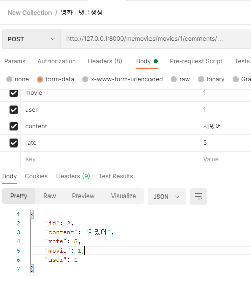
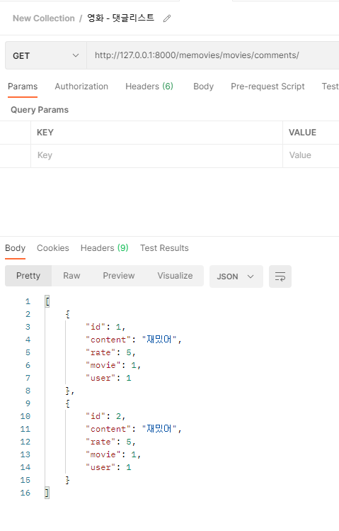
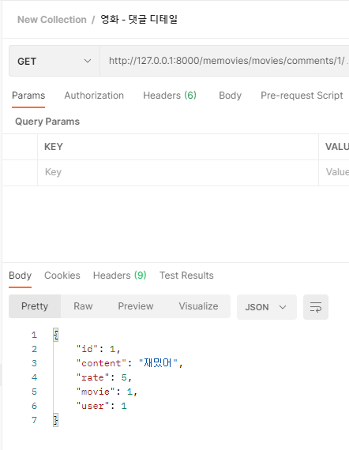

# 5/22

- 영화 댓글 기능 구현
- 좋아요 기능 (진행중)

---------

- 영화 - 댓글 생성

  

- 영화 - 댓글 리스트

  

- 영화 -댓글 디테일

--------

## 느낀점

- 영화 댓글기능은 리뷰게시판 구현하듯 무난하게 구현하였다. :happy:

- 중간에 댓글기능에 대해서 나현이가 영화의 상세페이지와 함계 댓글도 보내달라고 했었는데 

  메인페이지에 있는 영화들을 각가의 댓글을 달라는것인줄 알고 구현못하고 동동거렸다. 

  그런데 제대로 요구하는 걸 이해했으면 충분히 할수있었다.  아쉽...:cry: 

- 요구하는 것을 정확히 세세하게 파악하고 요구해야 된다는걸 느꼈다. 또한 보이스톡 없이 진행하다보니 소통의 어려움을 많이 느꼈다. 오프라인 하고싶다.....:sob:

- 좋아요 기능 구현하는데 왜안될까?? 

  - 일단 포스트맨에서 성환형한테 로그인한채로 진행하는걸 배웠는데 왜 안될까...
  - username, user.id , user_id , pk 뭐를 받아야되는걸까 머리가 아찔하다. :weary: