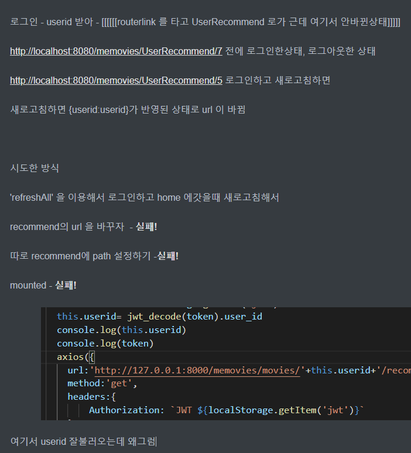

# 5/24

Vue 유저별 추천페이지 구현 (진행중)

--------------

-  :exclamation: ​유저별 추천페이지 백을 완성하고 프론트에서 돌렸는데 예전 페이지가 남는 현상  :exclamation:
   - URL의 변수(userid)는 잘받았는데 웹페이지의 url이 변경되지않는다.
   - 그래서 전의 페이지인채로 남아있다.
   - 실패 ​실패 실패 실패 실패 실패 :sob:

계속 뭔가 시도를 했으나 실패... 최후의 방법인 스택 오버플로우에 질문을 올리고 마무리했다.

https://stackoverflow.com/questions/67670721/how-do-i-change-url-in-the-vue

------

## 느낀점

- 진짜 오늘은 무기력했다. 뷰가 미숙해서 그런가 하루종일 페이지 잡고 늘어져있었다.