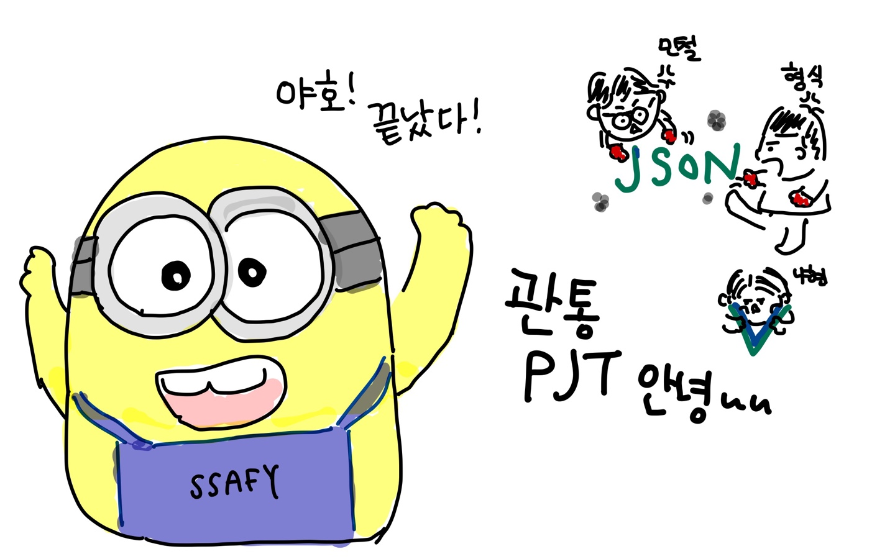
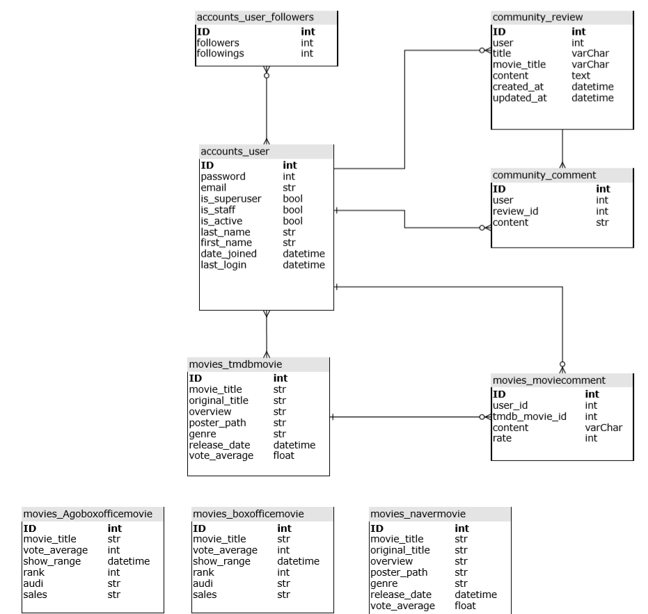

# MEMOVIES

- Memory + Movies / Me + Movies!
  - 그 시절 우리들의 그 영화
  - 추억을 그리며 N년전 영화를 추천!
  - 내가 좋아요를 누른 영화와 비슷한 장르의 영화를 추천!

## BACK

- 공통적으로 어려웠던 부분
  - 어떤 url이든 front쪽으로 데이터를 넘겨줄 때 너무 어려웠음
  - 어떤 JsonResponse, HttpResponse, Respone를 돌아가면서 필요한거에 맞춰서 썼는데 
    - 데이터가 Json으로 갈줄 알았는데 str로 가고, return dict는 바로 dict처럼 못쓰고 등등
    - 프론트에서 데이터를 받았을 때 데이터를 통일해서 쓸 수 있게 방법을 찾아내는게 어려웠다.
    - 그래도 하다보니까 vue devtools랑 print, console찍어가면서 해결하게 되더라
- 최종 ERD
  - 처음에 프로젝트를 시작하기전 생각했던 모델과 변경된 점이 많았다
  - 프로젝트를 진행하다보니 하나의 모델로 해결할 수 없어서 두개로 나눈 경우도 생기고(Agoboxoffice, boxoffice)
  - 1 : N, M : N 관계를 다시 정립하면서 수정되는 부분도 많았음

### accounts

- 회원가입, 팔로우의 경우는 기존에 배웠던거에서 변경사항이 거의 없었다

### community

- 여기도 기존 학습내용과 큰 차이점이 없었음

### movies

- index
  - tmdb, 네이버, 영화진흥회의 데이터를 모두 받아와서 보여줌
  - 데이터를 객체에 담아서 보내줄 떄, serializer를 잘못설정해서 한참 고민했었음
  - 처음에 데이터를 불러오는 과정에서 시간이 오래걸렸음
    - 가장 처음 생각한 로직은 model을 받아올때마다 delete로 초기화시키고
    - 다시 받아오는건데 이러면 페이지가 너무 느려지더라 그래서
    - 한번 받아오고 if문으로 model에 db가 있는지 없는지 확인한 후
    - 있다면 그냥 그걸 그대로 쓰는 식으로 바꿈
- like
  - 여기서 model설정이 한번 크게 바뀜 좋아요를 위한 model을 따로 만들었는데
  - 만들다 보니까 M:N을 쓰면 한번에 해결되는 부분이었음

- recommend
  - 우리 프로젝트의 가장 핵심인 부분 중 하나
  - N(1, 3, 5)년 전 오늘의 영화 랭킹을 받아와서(영화진흥회api사용) 보여주는 페이지
  - 여기서 boxoffice와 똑같은 모델인 Agoboxoffice를 만들었는데,
  - 여기는 날짜가 변하면 들어있는 데이터도 변해야 하기 때문에 
  - 받아올 때마다 Delete를 해주고 새로 받아옴(데이터 개수를 조절해서 느리지 않게 함)

- user_recommend
  - Tmdb데이터에 있는 genre를 이용해서 유저가 좋아요를 누른 영화와 일치하는 genre값을 가진 영화를 추천해줌

## 느낀점

- 나현
  - 일단 내가 하고싶은대로 진행하게 해준 민철이형님 형식이형님에게 모든,,,무한 감사를,,
    하고 싶었던거를 일단 95% 정도 완성하게 되서 너무 뿌듯하다. 사실 처음에 우리가 욕심이
    많아서 좀 하고싶었던게 많았는데? 점점 시간과 내 개인적인 스케쥴로 타협해 가는게 너무 
    웃기곸ㅋㅋㅋㅋ그래도 충분히 너무 만족스럽다.
  - git도 이제 branch사용할 수 있을 것 같고, 무엇보다 내가 server쪽 코딩이 매우 약한데(관심
    없어서 공부 안함.. 싫어하는거는 죽어도 공부안하는거는 평생 못고친다능~) 그거를 
    든든하게 다 지원해주신 두 형님들께 압도적 감사를,, 그 덕분에 여유롭게 나는 프론트를 할 수 있었다.
  - 사실 처음에는 component어쩌구 다 짜는게 너무너무 힘들고 고독한 싸움이였는데 
    나중에 갈 수록 휘뚜루 마뚜루 할 수 있었다. 아 나이제 뷰 천재인가?
    협업은 너무 재밌고,,알찬 일주일이였지만,,,,,,,, 빨리 취업하고 싶다^6,,^,,!!
- 형식
  - 하고 싶은게 많았는데 예상치 못한 문제들이 너무 많아서 구현하지 못한 부분들이 아쉽다.
  - 해결되지 않는 문제들을 함께보고, 토의하고, 해결하는 과정에서 많이 배울 수 있었다.
  - 깃헙을 통해 협업하는 과정이 현업에도 크게 도움이 될 것 같다.
  - 그래서 캐러셀 왜 안됨?
- 민철
  - 꿀잼...팀플이었다.... '조장하실 분...?'이라는 질문에 손을 드는 사람이 있는 팀플이 있다니 여긴 유토피아가 아닐까?
  - git을 통한 협업..........에러나서 찾다보면 어떻게든 되더라 내 인생처럼
  - 현실과 타협을 많이하게 됐다. 그렇다 아무리 위를 쳐다봐도 내가 있는 곳은 아래였던거임 ㅎ
  - Front/ Back을 나눠서 뭔가 뚝딱뚝딱 할 줄 알았는데 그런거... 존재 하지 않았다. 서로 왔다갔다 하면서 도움을 주고 받음. 이래서 협업 경험이 중요하단 걸 알았다. 같은 내용에도 다른 생각을 하게 되더라. 첫 협업에 큰 도움을 주신 두분께 무한한 감사를...

