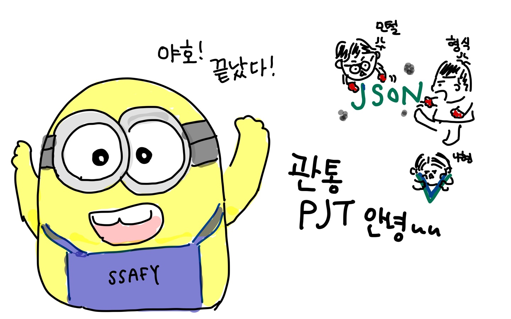
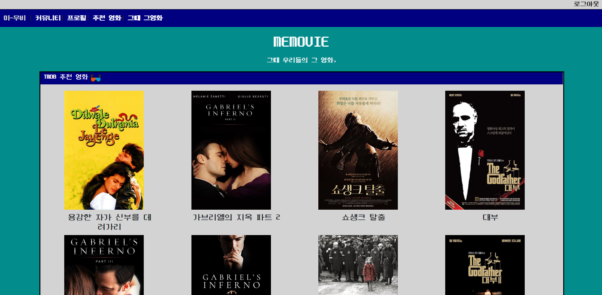

# MEMOVIES

- Memory + Movies / Me + Movies!
  - 그 시절 우리들의 그 영화
  - 추억을 그리며 N년전 영화를 추천!
  - 내가 좋아요를 누른 영화와 비슷한 장르의 영화를 추천!

## FRONT

- 페이지, 파일이 많아지다 보니까 관리하기가 굉장히 어려웠음
- 이래서...이름을 잘 정하라고 하셨구나~ 싶었다.
- 서버에서 보내주는 데이터를 받아 쓰는게 어려웠음
  - 처음엔 뚝딱하면 되는건줄 알았는데 post man에서보면 데이터가 넘어오는데... 왜 front에서 쓰질못해...

## 디자인

- 모든 컨셉은 '그 시절'을 떠올릴 수 있는 Window 98임

- 아이콘, 폰트, 전체적인 분위기 모두 비슷한 느낌을 줄 수 있게 꾸밈

  

### App.vue

- 큰 틀을 짜기위한 과정이었다
- 어디서 view router로, 어디서 components로 갈지 정하는 작업
- vue 자체의 #nav에 있는 것들 중 특정요소만 정렬하는게 복잡했음
  - div로 감싸서 margin을 주는 방식으로 해결했다.

### components

- BoxOfficeItem.vue
- BoxofficeMovieITem.vue
- MovieItem.vue
- NaverMovieItem.vue

### router

- index.js

### views

- Home.vue
  - 영화 정보를 보여주는 Main page 모든 영화 list를 보여준다
  - 각각의 MovieItem들과 연결
  - Detail페이지와는 다르게 개별 영화요소를 보여줌(전체에서)

- accounts

  back에서 넘어오는 데이터를 Jwt_decode를 통해 다시 내가 원하는 정보(userid, username등등)으로 변환하는 과정이 어려웠음

  - Login.vue
  - Profile.vue
  - Signup.vue

- community

  전체 review에서 제목들을 나타내는 페이지

  - Community.vue
  - ReviewCreate.vue
  - ReviewDetail.vue
    - 다른 부분들은 특이사항이 없었음 근데 ReviewDetail에서 
    - 동적 라우팅을 통해 : 값을 넘겨 줘야 하는 걸 알았음(몰라서..고생했었다)

  - ReviewListItem.vue
  - ReviewUpdate.vue

  

- movies

  영화정보를 나타내는 페이지

  - BoxofficeMovieDetail.vue
  - MovieDetail.vue
  - NaverMovieDetail.vue
  - Recommend.vue
    - 여기서 N년전 영화를 보여줌
  - UserRecommend.vue
    - 사용자가 좋아요 누른 영화와 비슷한 장르의 영화를 보여줌

## 느낀점

- 나현
  - 일단 내가 하고싶은대로 진행하게 해준 민철이형님 형식이형님에게 모든,,,무한 감사를,,
    하고 싶었던거를 일단 95% 정도 완성하게 되서 너무 뿌듯하다. 사실 처음에 우리가 욕심이
    많아서 좀 하고싶었던게 많았는데? 점점 시간과 내 개인적인 스케쥴로 타협해 가는게 너무 
    웃기곸ㅋㅋㅋㅋ그래도 충분히 너무 만족스럽다.
  - git도 이제 branch사용할 수 있을 것 같고, 무엇보다 내가 server쪽 코딩이 매우 약한데(관심
    없어서 공부 안함.. 싫어하는거는 죽어도 공부안하는거는 평생 못고친다능~) 그거를 
    든든하게 다 지원해주신 두 형님들께 압도적 감사를,, 그 덕분에 여유롭게 나는 프론트를 할 수 있었다.
  - 사실 처음에는 component어쩌구 다 짜는게 너무너무 힘들고 고독한 싸움이였는데 
    나중에 갈 수록 휘뚜루 마뚜루 할 수 있었다. 아 나이제 뷰 천재인가?
    협업은 너무 재밌고,,알찬 일주일이였지만,,,,,,,, 빨리 취업하고 싶다^6,,^,,!!
- 형식
  - 하고 싶은게 많았는데 예상치 못한 문제들이 너무 많아서 구현하지 못한 부분들이 아쉽다.
  - 해결되지 않는 문제들을 함께보고, 토의하고, 해결하는 과정에서 많이 배울 수 있었다.
  - 깃헙을 통해 협업하는 과정이 현업에도 크게 도움이 될 것 같다.
  - 그래서 캐러셀 왜 안됨?
- 민철
  - 꿀잼...팀플이었다.... '조장하실 분...?'이라는 질문에 손을 드는 사람이 있는 팀플이 있다니 여긴 유토피아가 아닐까?
  - git을 통한 협업..........에러나서 찾다보면 어떻게든 되더라 내 인생처럼
  - 현실과 타협을 많이하게 됐다. 그렇다 아무리 위를 쳐다봐도 내가 있는 곳은 아래였던거임 ㅎ
  - Front/ Back을 나눠서 뭔가 뚝딱뚝딱 할 줄 알았는데 그런거... 존재 하지 않았다. 서로 왔다갔다 하면서 도움을 주고 받음. 이래서 협업 경험이 중요하단 걸 알았다. 같은 내용에도 다른 생각을 하게 되더라. 첫 협업에 큰 도움을 주신 두분께 무한한 감사를...