# 영화 페이지 설계 프로젝트

### 주제 - "그때 그 영화" 

: 레트로 디자인의 웹사이트를 구성하고, 그에 맞게 n년전의 박스오피스 순위를 나열해서 그 영화들을 추천하는 기능을 갖춘다.


### 페이지 설계

- 메인 페이지
  - 기존 영화들 나열
  - 영화에 좋아요 기능
- 영화 상세 페이지
  - 영화에 대한 댓글 기능
  - 코멘트와 더불어 평점 매기기 가능
  - 영화의 상세페이지에는 유투브 리뷰의 영상이 표시된다.
- 게시판
  - 영화에 따른 리뷰글 생성 가능
  - 리뷰글에 코멘트 생성가능
- 추천 페이지 
  - 영화 추천으로서 박스오피스 API를 조회해서 n년전 영화 순위를 나열해 추천한다.
- 회원가입
  - 아이디, 비밀번호 뿐만아니라 age, MBTI를 입력해서 추가적인 추천기능에 반영할 수 있게 한다.
- 프로필
  - 프로필에는 로그인한 사용자의 댓글과 좋아요한 영화, 영화의 리뷰를 확인할 수 있다.


### 역할 -백엔드

5/20 

- 모델 ERD 설계
- 게시판 구현 - 리뷰 CRUD, 리뷰의 댓글 CRUD 구현

5/21

- 박스오피스 API DB에 넣어서 프론트에 넘겨주기
- 박스오피스 API를 통해서 추천페이지 구현
- 영화의 댓글기능 (구현 중)


# 5/20

- 모델 ERD 설계

- 게시판의 구현 - 리뷰생성 + 리뷰의 댓글 생성

-----------

### ERD

- ERD 다이어그램 툴 : Draw.io  사용

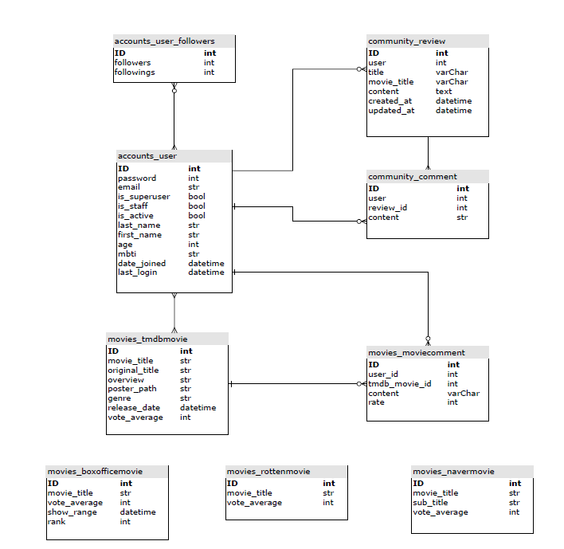


### Community

- 리뷰 게시판은 기본적인 CRUD를 구현


- 커뮤니티-리뷰생성

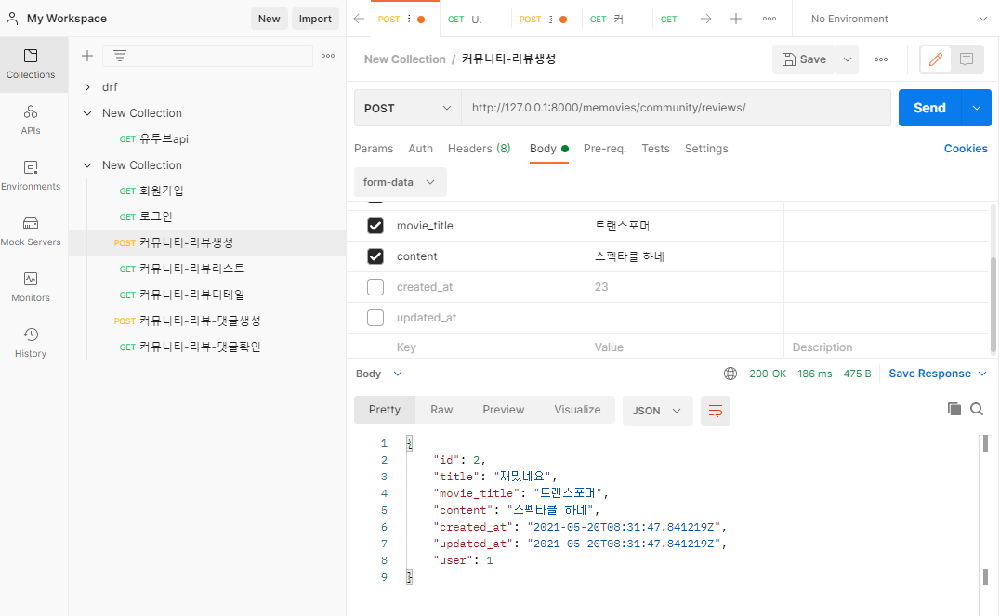


- 커뮤니티-리뷰리스트

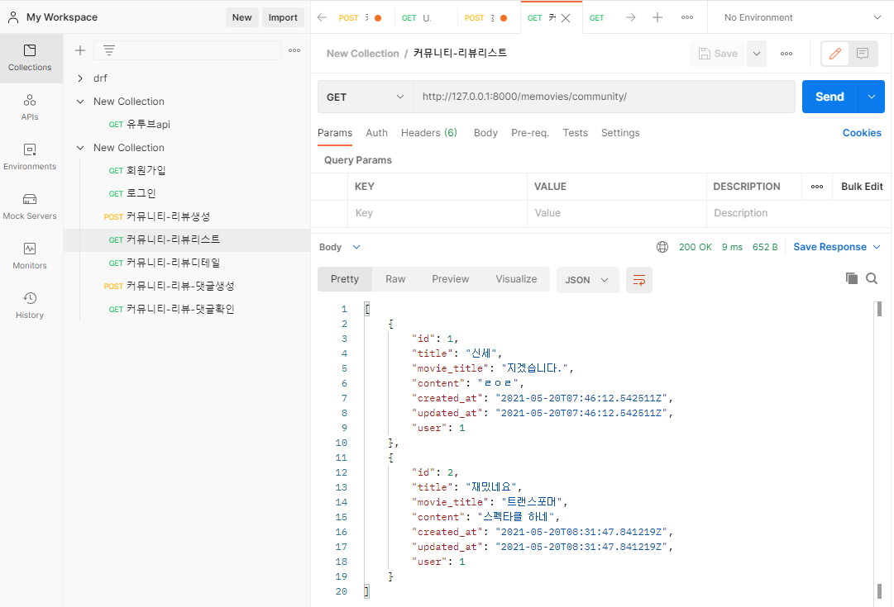


- 커뮤니티-리뷰디테일

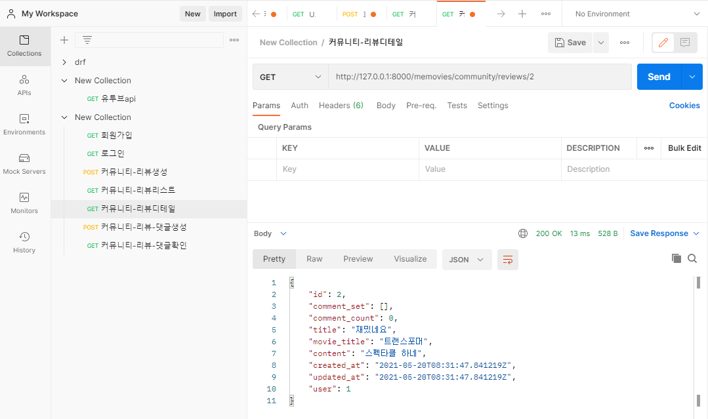


- 커뮤니티-리뷰- 댓글생성

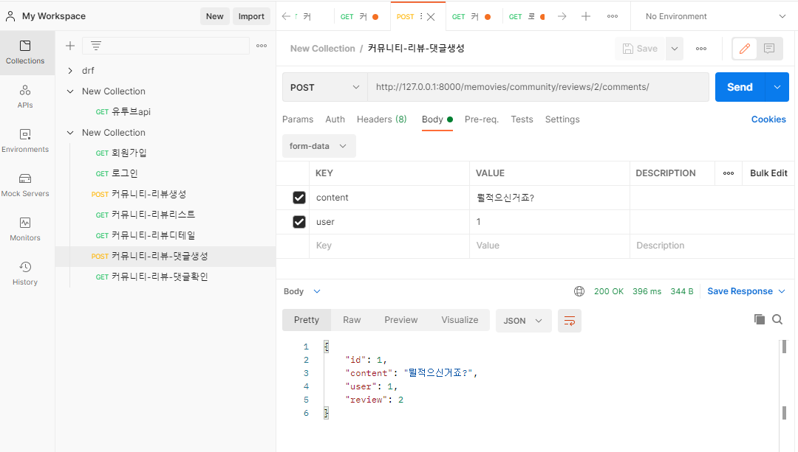


- 커뮤니티-리뷰- 댓글확인

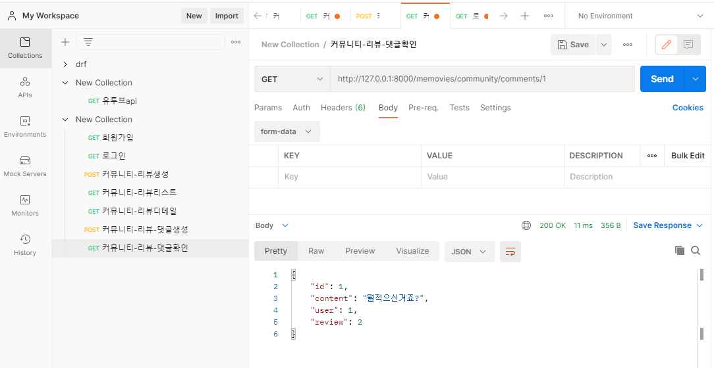


# 5/21

- 박스오피스 API DB에 넣어서 프론트에 넘겨주기
- 박스오피스 API를 통해서 추천페이지 구현
- 영화의 댓글기능 (구현 중)

------

### Box office API

박스오피스 API 를 불러와서 장고에서 데이터를 가공하고 프론트에 넘겨주는게 계획이었다.

api는 쉽게 구할수있었다.

https://www.kobis.or.kr/kobisopenapi/homepg/apiservice/searchServiceInfo.do

- 과정 

  0. 나는 프론트에게 1년치 박스오피스 데이터를 줘야한다. 그런데 데이터는 일별 박스오피스이다.

     `for`문을 돌려서 20200521 ~ 20210521 를 순차적으로 나타내야하는데

     이때 `datetime`을  이용해서 31일에서 1일로 가는 날짜의 진행을 잘 넘길수있었다.

  ```python
  today = datetime.now()
      start_day = today + timedelta(days=-(365*5)) # 5년전부터 시작
      for count in range(10): # ex)10일
          start_day = start_day + timedelta(days=1) # 다음날의 박스오피스
          day= str(start_day)[0:10].replace("-","")
         
  ```

  

  1. 박스 오피스 API를 가져온다

  ```python
  box_office = 		requests.get(f'https://kobis.or.kr/kobisopenapi/webservice/rest/boxoffice/searchDailyBoxOfficeList.json?key={key}&targetDt={day}')
  # REST 방식 API 요청
  
  box_office = box_office.json()['boxOfficeResult']
  # 받은 API를 json화
  ```

  2. API에서 영화들의 필요한 요소만을 모델에 넣는다.

  ```python
  now_show_range = box_office.get('showRange')[:8]
          for movie in box_office['dailyBoxOfficeList']:
            	cnt+=1
              new_movie = BoxofficeMovie(
                      pk = cnt,
                      movie_title=movie.get('movieNm'),
                      show_range =now_show_range,
                      rank=movie.get('rank'),
                  )
              new_movie.save()
      movies = BoxofficeMovie.objects.all()
  ```

  3. 시리얼라이저화 시켜주고 프론트에 넘긴다.

  ```python
  BoxOffice = serializers.serialize('json', movies)
  return HttpResponse(BoxOffice, content_type='application/json')
  ```

  

일단 배운 방식으로 진행을 하였는데  데이터를 받아오는데 상당한(?아마?) 시간이 걸린다.

의문을 가지고 내가 한 방식을 스택오버플로우에 올렸는데 

돌아오는 답변은 지금 한방식은 구식적인 방식이고 현대적인 방식으로 DRF 사이트를 넘겨줬다.

:grey_question::grey_question::grey_question::grey_question::grey_question::grey_question::grey_question:

아마 DRF 를 좀더 살펴보면 API를 다루는 방식이 있는듯하다.


- 메인 페이지 - 박스오피스 1~10위 까지의 데이터

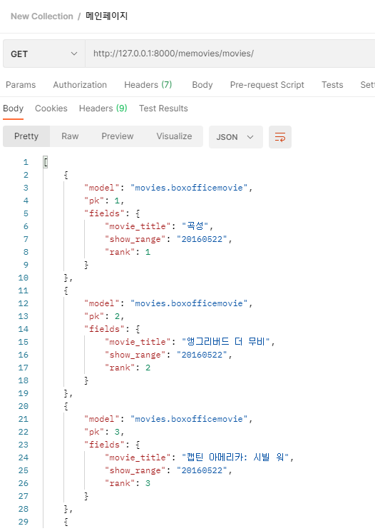


### Recommend 

이미 박스오피스 API를 불러오는 방법과 `datetime`을 다룰줄 알기 때문에

n년전 박스오피스를 넘기는것은 쉬웠다.


- 추천알고리즘 - 현재시간으로 부터 n년전의 박스오피스 1~10위

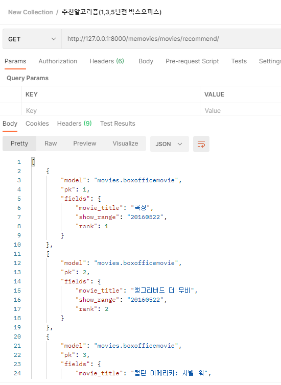


# 5/22

- 영화 댓글 기능 구현
- 좋아요 기능 (진행중)

---------


- 영화 - 댓글 생성

  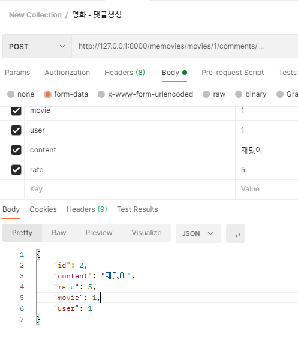

- 영화 - 댓글 리스트

  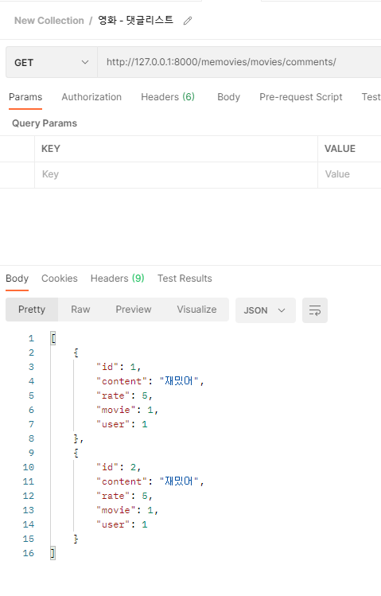

- 영화 -댓글 디테일

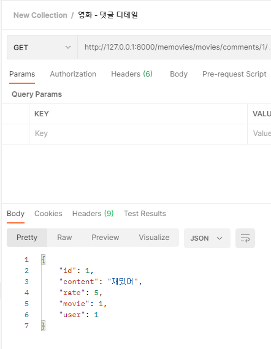


# 5/23

- 영화 좋아요 기능 구현
- 영화 유저별 추천 영화 구현
- 데이터 로드 속도 개선
- Vue 유저별 추천페이지 구현 (진행중)

----------

-  :exclamation: 데이터 로드속도가 너무 느린 현상  :exclamation:
  - 보니깐 데이터의 시리얼라이즈를 두번씩했다. 한번으로 수정
  - if 를 통해 데이터가 들어있는 경우 데이터를 새로 불러오지 않도록 조치


# 5/24

Vue 유저별 추천페이지 구현 (진행중)

--------------

-  :exclamation: ​유저별 추천페이지 백을 완성하고 프론트에서 돌렸는데 예전 페이지가 남는 현상  :exclamation:
  - URL의 변수(userid)는 잘받았는데 웹페이지의 url이 변경되지않는다.
  - 그래서 전의 페이지인채로 남아있다.
  - 실패 ​실패 실패 실패 실패 실패 :sob:

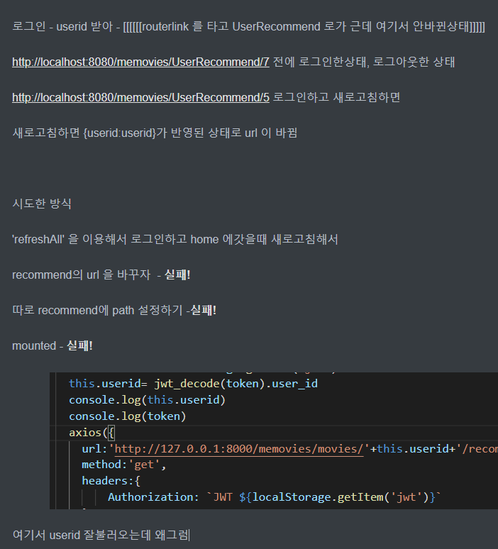

계속 뭔가 시도를 했으나 실패... 최후의 방법인 스택 오버플로우에 질문을 올리고 마무리했다.

https://stackoverflow.com/questions/67670721/how-do-i-change-url-in-the-vue


# 5/25

Vue 유저별 추천페이지 구현 (갓민철! 갓민철! 갓민철!)

-----명세끝--------

네이버 API 이용해서 박스오피스의 포스터 속성 연결해주기

메인페이지에 네이버API 영화 데이터 프론트로 넘겨주기

n년전 박스오피스 구성, 프론트 구현

----------

-  :exclamation: 유저별 추천페이지 백을 완성하고 프론트에서 돌렸는데 예전 페이지가 남는 현상  :exclamation:

  - 어제 그렇게 속을 썩혔던 문제 
  - 

  

- 네이버 API 이용해서 박스오피스의 포스터 속성 연결

  - https://yobro.tistory.com/m/151?category=799433 :thumbsup:

  - 데이터의 형태를 파악해서 잘 불러오는건 TMDB나 박스오피스든 API라면 필수적인 과정인듯하다.

    

- 네이버 영화검색 API 이용해서 박스오피스의 포스터 속성 연결

  - 박스오피스의 API에는 영화포스터가 없다
  - 박스오피스 영화의 `movieNm`을 변수로 넘겨서 네이버 API에서 포스터를 받아와 넣었다. 

  ```python
  for movie in box_office['dailyBoxOfficeList']:
              box_movie=movie.get('movieNm')
              url = f"https://openapi.naver.com/v1/search/movie.json?query={box_movie}"
              res=requests.get(url,headers=header_parms)
              data =res.json()
              new_movie = BoxofficeMovie(
                      pk = cnt,
                      movie_title=movie.get('movieNm'),
                      poster_path= data['items'][0]['image'],
              )
  ```

  

- :heavy_exclamation_mark: 메인페이지에 TMDB 는 잘불러와지는데 Naver 랑 Boxoffice가 제대로 안불러와지는 현상​ :heavy_exclamation_mark:

  - 시리얼라이즈의 문제인걸 진작에 파악 하지만 뻘짓
  - serialize.py 에서  `serializers.ModelSerializer` 가 `serializers.Serializer` 였다. :face_with_head_bandage: 
  - 당연히 잘되있을거라 생각한 부분때문에 시간을 엄청 잡아먹었다.


- n년전 박스오피스 구성, 프론트 구현

  - 기본적인 페이지 구성이라 어렵진 않았지만 받은 데이터를 나누는거에 잠깐 멈칫하고 computed 사용

  ```vue
  <template>
    <div>
        <BoxOfficeItem v-for="movie in boxOffice_OneYears" :key="movie.id" :movie="movie"/>
    </div>
  </template>
  <script>
    computed: {
      boxOffice_OneYears: function () {
        return this.movieList.slice(0, 10)
      },
    }
  </script>
  ```

  


------------

### 느낀점

5/20

- 프로젝트의 컨셉과 추가기능을 애기하면서 웹사이트의 모습이 구체화되는걸 보면 재미있었다.  

- 본격적으로 깃헙을 통한 협업을 통해서 진행했는데 후에 팀프로젝트나, 현업에서 도움될만한 경험일것이다.

- ERD 생성을 하면서 확신이 안들때도 있어서 미숙한걸 느꼈지만 이는 실제로 구현을 진행하면서 고쳐나가도록 한다.

5/21

- API를 다루는 과정에서 아는게 많지 않아 처음부터 막막했으나, 검색과 민철이 형의 도움으로 박스오피스의  API를 프론트로 무사히 넘겨 줄수있었다.  :dancing_women: 갓민철! 갓민철! 갓민철! :dancing_men:
- 한번 API를 넘겨줘보니 추천알고리즘은 어렵지않았다.
- 한100개의 영화데이터를 넘겨주고 프론트에서 이를 끌어오는데 상당한 시간이 걸린다. 이부분을 최소화 해야한다. 

5/22

- 영화 댓글기능은 리뷰게시판 구현하듯 무난하게 구현하였다. :happy:

- 중간에 댓글기능에 대해서 나현이가 영화의 상세페이지와 함계 댓글도 보내달라고 했었는데 

  메인페이지에 있는 영화들을 각가의 댓글을 달라는것인줄 알고 구현못하고 동동거렸다. 

  그런데 제대로 요구하는 걸 이해했으면 충분히 할수있었다.  아쉽...:cry: 

- 요구하는 것을 정확히 세세하게 파악하고 요구해야 된다는걸 느꼈다. 또한 보이스톡 없이 진행하다보니 소통의 어려움을 많이 느꼈다. 오프라인 하고싶다.....:sob:

- 좋아요 기능 구현하는데 왜안될까?? 

  - 일단 포스트맨에서 성환형한테 로그인한채로 진행하는걸 배웠는데 왜 안될까...
  - username, user.id , user_id , pk 뭐를 받아야되는걸까 머리가 아찔하다. :weary:


5/23

- 포스트맨에서 로그인하는법이 view에서 데코레이터를 안해줘서 토큰을 읽지못했었다 이부분을 해결하고 로그인채로 좋아요기능 만들기 시작하니 뚝딱 했다. 
- 데이터를 불러오는게 느렸는데 다른 팀원들한테 물어보면서 봤는데 다양한 방식들이 나와서 다들 천재인줄..
  - 코딩에 시리얼라이져가 두번하는 실수가있었는데 그걸 동건이가 캐치했다. :thumbsup:
- 유저별 추천페이지를 구현하는데 역참조를 하면 더쉬웠을까? 라는 생각이 맴돈다. 일단 구현했으니 명세서 살펴보고 한번 더 봐야할 부분이다.
- 뷰를 이용해 추천페이지를 만들어야하는데 역시 뷰는 배운지 얼마안되고 미숙하다보니 어렵다.
- 내일 명세 어떻게든 마무리 짓고 맘편히 진행하고 싶다. ㅠㅠ 그래도 오늘은 진행을 많이해서 만족스럽다.


5/24

- 진짜 오늘은 무기력했다. 뷰가 미숙해서 그런가 하루종일 페이지 잡고 늘어져있었다.


5/25

- 민철이형이 어제의 문제를 해결해주었다. :dancing_women: 갓민철! 갓민철! 갓민철! :dancing_men:
- 명세가 끝나고 좀 편할줄 알았는데 생각보다 할게 많이 남아있다.
- 장고도 그렇지만 뷰에대해서 좀미숙했는데 조금씩 참여하면서 만져보니 부분부분 이해가 간다.